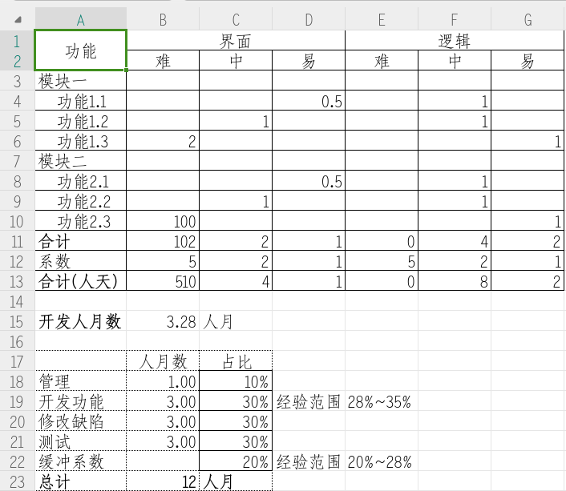

# 项目管理 - 项目估算流程

## 估算的目的

- 估计项目的人月数
- 估计项目的发布日
- 帮助决定项目做哪些任务
- 帮助设计日程计划
- 让别人了解任务大概在什么时候完成
- 让别人了解任务的工作量多大

## 项目估算的时间点

- 设计完成之后

## 估算项目人月数的方法

### 模板：人月估算表

- [人月估算表](./templates/estimation.xlsx)

### 基于开发人月数的估计

**准备工作**  
建立一个项目的特性列表。  
针对每个特性，建立一个功能列表。

**建立估算表**  
建立一个 Excel 表格，类似如下

  
说明：

- 只估计开发的时间。（这个模板是根据开发人员的工作量来估计总体时间）  
  当然，你也可以根据需要，分别估计管理，开发，测试和运维的时间
- 估算值可以输入整数或者小数
- 难：代表 5 天
- 中：代表 2 天
- 易：代表 1 天
- 根据经验，修改管理、开发功能、修改缺陷、测试和缓冲系数的占比。
- 最后总计就是项目估算的人月数。

> 使用上面的方法，在有个多个项目的经验之后，会越来越精确。

## 估算发布日

- 最直接的方法是建立日程计划
