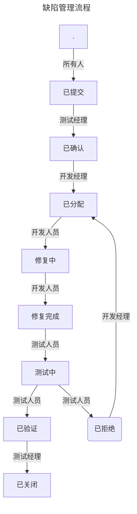

## 流程

- 缺陷管理流程  
- 新功能开发管理流程  
- 代码冻结流程  

## 角色

- 测试经理  
- 测试者  
- 开发经理  
- 开发者  
- 所有人  
	所有人包括团队中的任何人，除了前面列出的角色，还包括，项目经理，产品经理等等其它角色。  

## Issues 种类

- 缺陷 (defect)  

- 增强请求 (enhancement request)  
客户提出的需求。  
常见的是：客户提出的缺陷，经过技术判断后，转成增强请求。  
需要产品经理来决定是否支持。  

- 功能 (feature)  

- 史诗/故事/任务 (epic/store/task)  
敏捷项目管理的方式  

- 任务 (task)  

## Issues 的字段

| 字段名 | 说明 |  
| - | - |  
| 标题 | |  
| 内容 | |  
| 类型 | 比如：需求、任务、缺陷。不同的类型，工作流会不同。 |  
| 状态 | 比如：待办的、进行中、已完成、已拒绝。 |  
| 优先级 | 比如：严重、主要、次要、不重要。 |  
| 负责人 | 可以是多个人 |  
| 标签 | 比如: `bug`, `duplicate`, `enhancement` `feature` `invalid` `question` `wontfix`|  
| 里程碑 | |  
| 分支 | 可以等同于版本 |  
| 开始日期 | |  
| 截止日期 | |  
| Pull Requests | |  
| 评论 | |  

## 标签管理 (tags)

标签可以方便实现一些弱管理流程。  

### 支持敏捷项目管理的任务
定义标签：`epic`, `story`, `task`  

### 支持站立会的阻碍问题
定义标签: `blocked` 或者 `impediment`  

### 支持Issue属于哪个小组
定义标签: `team-front`, `team-backend`, `team-db`  

### 支持缺陷属于哪个新开发的功能
定义标签: `feat-abc`, `feat-xyz`  

### 支持特定的缺陷级别
定义标签: `shipkiller`, `blocked`  

## 缺陷级别

-   严重 (serious)  
    主业务流程不能进行；严重数据问题 。  
    比如：  
    工资系统，不能计算工资  
    工资计算错误  
  
-   主要 (major)  
    主要功能错误；数据错误 。  
    比如：  
    职员姓名显示错  
    工资单数据不对  
  
-   次要 (minor)  
    不重要的功能错误。  
    功能不方便使用。  
  
-   不重要 (mild)  
    瑕疵问题。  
    比如：界面上组件没有对齐，颜色问题。  

-   发布杀手 (shipkiller)  
    发布前使用，表示必须要修好，产品才能发布。  
  
-   阻碍 (blocked)  
    开发过程中使用，表示某人因为这个问题，工作无法继续。  
    比如：阻碍了测试人员测试工作，或者开发人员的开发工作。  
    也可以用于自动构建、单元测试、自动测试碰到的阻碍问题。  

## 缺陷级别的考虑因素

业务，功能，数据，交互。  

## 缺陷状态

已提交 (任何人)  
已确认 (QA经理)  
已分配 (Dev经理)  
修复中 (Dev)  
修复完成 (Dev)  
测试中 (QA)  
(测试完成) (QA)  
已拒绝 (->已分配) (QA)  
(已发布)  
已关闭 (QA)  

## 缺陷版本

各个版本号  
未分配  

## 缺陷管理流程

